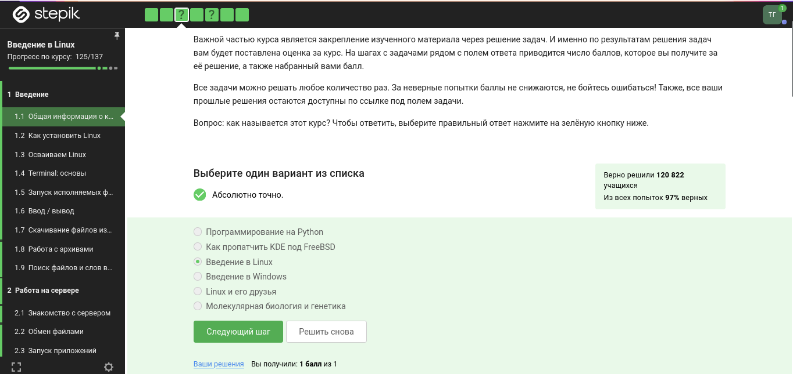
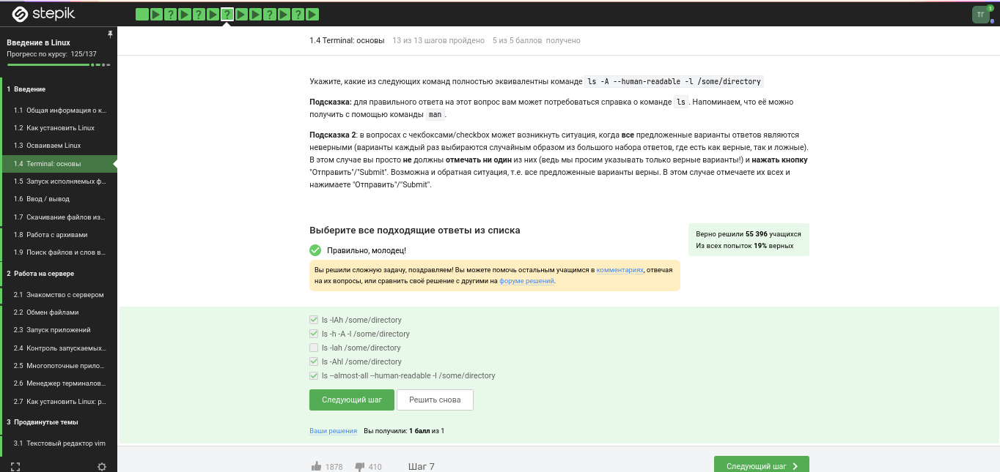

---
## Front matter
lang: ru-RU
title: Прохождение 1 этапа внешних курсов
subtitle: Введение в Linux
author:
  - Хан Г. И.
institute:
  - Российский университет дружбы народов, Москва, Россия
date: 2026

## i18n babel
babel-lang: russian
babel-otherlangs: english

## Formatting pdf
toc: false
toc-title: Содержание
slide_level: 2
aspectratio: 169
section-titles: true
theme: metropolis
header-includes:
 - \metroset{progressbar=frametitle,sectionpage=progressbar,numbering=fraction}
 - '\makeatletter'
 - '\makeatother'
---

# Цель и задание

## Цель работы

Ознакомиться с функционалом операционной системы Linux.

## Задание

- Просмотреть видео курса «Введение в Linux»
- На основе полученной информации пройти тестовые задания

# Теоретическое введение

## Что такое Linux

- Семейство Unix-подобных операционных систем на базе ядра Linux
- Включает утилиты и программы проекта GNU
- Создаётся и распространяется по модели свободного ПО
- Распространяется бесплатно в виде различных дистрибутивов

# Выполнение — Основы системы

## Задание 1–2. Знакомство с курсом

{#fig:001 width=70%}

- Курс называется «Введение в Linux»
- Изучены критерии прохождения курса

## Задание 3–4. Операционные системы и VirtualBox

{#fig:002 width=70%}

- Стандартная ОС большинства магазинов — Windows
- VirtualBox позволяет запускать одну ОС внутри другой

## Задание 5–6. Виртуальная машина и работа с файлами

- Виртуальная машина успешно запускает Linux
- Документ создан и прикреплён к курсу в нужном формате

## Задание 7. Формат пакетов deb

- **deb** — формат пакетов проекта Debian
- Используется также в Ubuntu, Knoppix и других производных

# Выполнение — Командная строка

## Задание 11–12. Регистрозависимость

{#fig:003 width=70%}

- Интерфейс командной строки Linux **регистрозависим**
- Команда с заглавной буквой ≠ команда со строчной

## Задание 13–14. Навигация и удаление

- Для перехода в другую директорию — указывается полный путь
- `rm -r` — удаление директории и всех файлов внутри рекурсивно

## Задание 16–17. Фоновый режим

- `&` в конце команды — запуск программы в **фоновом режиме**

## Задание 19. Операторы перенаправления потоков

| Оператор | Действие |
|----------|----------|
| `< file` | Файл как источник stdin |
| `> file` | stdout в файл (перезапись) |
| `>> file` | stdout в файл (дозапись) |
| `2> file` | stderr в файл |
| `&> file` | stdout и stderr в файл |

# Выполнение — Утилиты

## Задание 22. Флаги wget

- `-q` / `--quiet` — отключить вывод wget
- `-P` — указать папку для сохранения
- `-O` — задать имя сохраняемого файла

## Задание 25–26. Архивирование

- **gzip** (GNU Zip) — утилита сжатия, алгоритм Deflate
- Флаги `tar`:
  - `c` — создать архив
  - `j` — использовать bzip2
  - `f` — работа с файловой системой

## Задание 28–29. Команда grep

{#fig:004 width=70%}

- Поиск с учётом регистра по умолчанию
- `grep -r "love" ~/Shakespeare/ > 1_m.txt` — рекурсивный поиск с сохранением результата

# Выводы

## Выводы

- Пройден 1 этап курса «Введение в Linux»
- Освежены навыки работы с архивами и утилитой wget
- Закреплены навыки работы с grep и перенаправлением потоков
