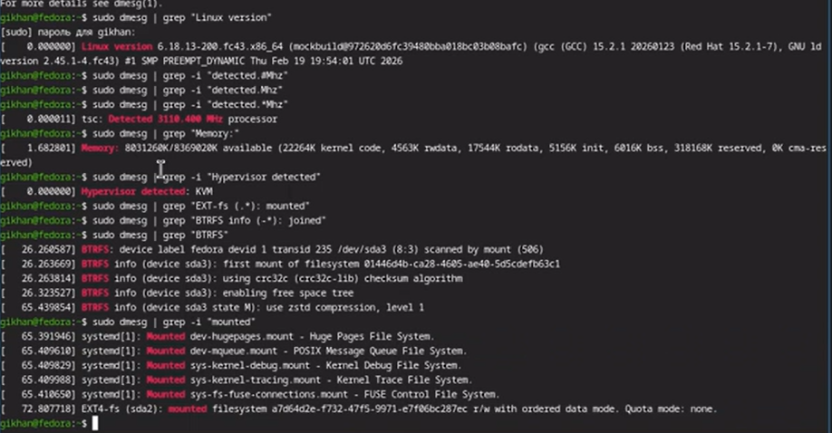

# Информация

## Докладчик

:::::::::::::: {.columns align=center}
::: {.column width="70%"}

  * Хан Георгий Игоревич
  * Студент НКАбд-06-25
  * я гоша
  * Российский университет дружбы народов
  * [1032253504@rudn.ru](mailto:1032253504@rudn.ru)

:::
::: 

# Цель работы
Целью данной работы является приобретение практических навыков установки операционной системы на виртуальную машину, настройки минимально необходимых для дальнейшей работы сервисов.

# Задание
- Установка Linux на VirtualBox
- Установка необходимого ПО
- Первоначальная настройка системы

# Теоретическое введение
Oracle VirtualBox — это программное обеспечение с открытым исходным кодом для виртуализации, позволяющее создавать и запускать виртуальные машины на компьютере с любой популярной операционной системой. Простыми словами, это программа, которая создаёт "компьютер внутри компьютера", где можно установить другую операционную систему, не затрагивая основную.

Виртуализация через VirtualBox создаёт изолированную среду, которая эмулирует аппаратное обеспечение компьютера. Это позволяет запускать полноценную операционную систему внутри вашей основной системы.

# Выполнение лабораторной работы
Установка Linux Fedora sway на VirtualBox. (рис. 1)

{#fig:001 width=70%}

После запуска виртуальной машины устанавливаю средства разработки. (рис. 2)

{#fig:003 width=70%}

Обновление пакетов. (рис. 3)

{#fig:004 width=70%}

Внутри виртуальной машины добавляю своего пользователя в группу vboxsf, В хостовой системе подключаю разделяемую папку. (рис. 4)

{#fig:006 width=70%}

# Домашнее задание
С помощью команд получаю информацию о системе. (рис. 5)

{#fig:007 width=70%}

# Выводы
В ходе выполнения лабораторной работы я приобрел навыки установки виртуальной машины на VirtualBox, установил ряд пакетов и настроил OC для дальнейшей работы.

