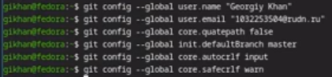
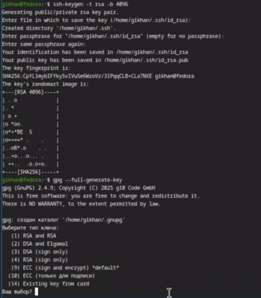
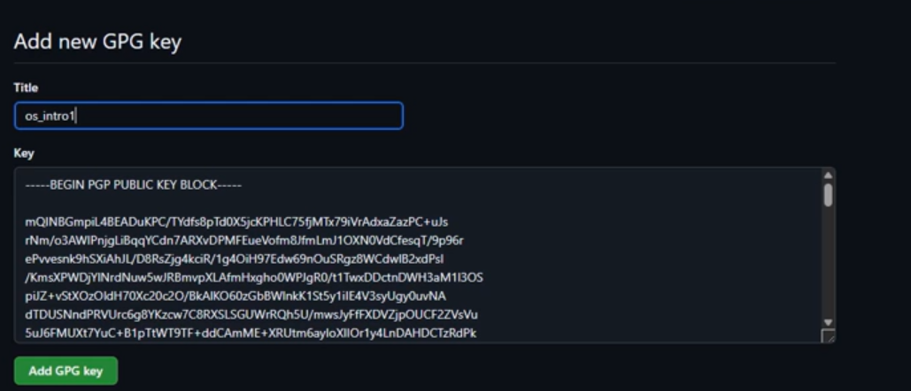
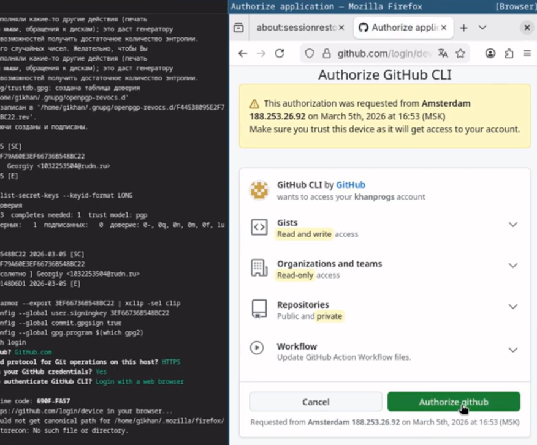
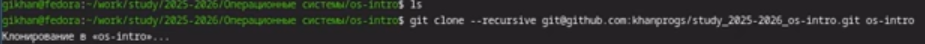

# Информация

## Докладчик

:::::::::::::: {.columns align=center}
::: {.column width="70%"}

  * Хан Георгий Игоревич
  * Студент НКАбд-06-25
  * я гоша
  * Российский университет дружбы народов
  * [1032253504@rudn.ru](mailto:1032253504@rudn.ru)

:::
::: 

# Цель работы
Изучить идеологию и применение средств контроля версий и
освоить умения по работе с git.

# Задание

- базовая конфигурация для работы с git
- ключ SSH
- ключ PGP
- подписи git
- каталог для выполнения заданий

# Теоретическое введение

Системы контроля версий (Version Control System, VCS) применяются при работе нескольких человек над одним проектом. Обычно основное дерево проекта хранится в локальном или удалённом репозитории, к которому настроен доступ для участников проекта. При внесении изменений в содержание проекта система контроля версий позволяет их фиксировать, совмещать изменения, произведённые разными участниками проекта, производить откат к любой более ранней версии проекта, если это требуется.

В классических системах контроля версий используется централизованная модель, предполагающая наличие единого репозитория для хранения файлов. Выполнение большинства функций по управлению версиями осуществляется специальным сервером. Участник проекта (пользователь) перед началом работы посредством определённых команд получает нужную ему версию файлов. После внесения изменений, пользователь размещает новую версию в хранилище. При этом предыдущие версии не удаляются из центрального хранилища и к ним можно вернуться в любой момент. Сервер может сохранять не полную версию изменённых файлов, а производить так называемую дельта-компрессию — сохранять только изменения между последовательными версиями, что позволяет уменьшить объём хранимых данных.

# Выполнение лабораторной работы
Произвожу базовую настройку git. (рис. 1)

{#fig:001 width=70%}

Создаю ssh и gpg ключи. (рис. 2)

{#fig:002 width=70%}

Экспортирую gpg ключ для авторизации на github. (рис. 3)

{#fig:004 width=70%}

Авторизуюсь на github для работы через терминал. (рис. 4)

{#fig:006 width=70%}

Создаю директорию курса по шаблону. (рис. 5)

{#fig:007 width=70%}

Настраиваю рабочую директорию. (рис. 6)

{#fig:008 width=70%}

# Выводы

В результате выполнения данной лабораторной работы я научился базовым навыкам работы с git: создание репозиториев, ssh и gpg ключе, настройка каталога курса и авторизация gh.

