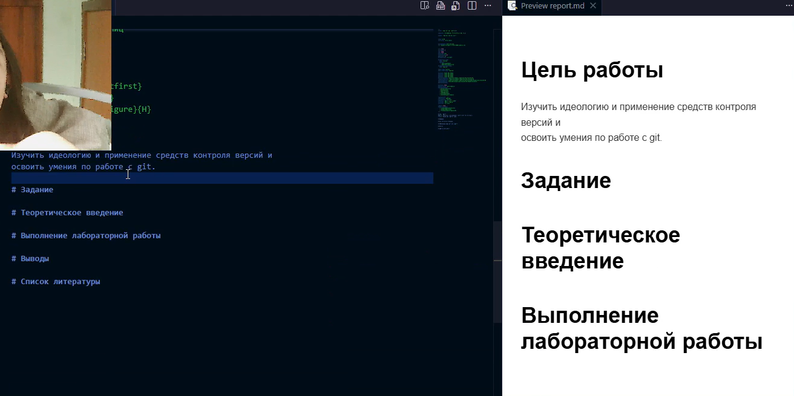
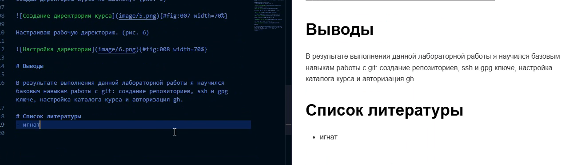

# Информация

## Докладчик

:::::::::::::: {.columns align=center}
::: {.column width="70%"}

  * Хан Георгий Игоревич
  * Студент НКАбд-06-25
  * я гоша
  * Российский университет дружбы народов
  * [1032253504@rudn.ru](mailto:1032253504@rudn.ru)

:::
::: 

# Цель работы

Научиться оформлять отчёты с помощью легковесного языка разметки Markdown.

# Задание

- Сделать отчет по предыдущей лабораторной работе в формате markdown
- В качестве отчета предоставить отчеты в 3 форматах: pdf, docx, md.

# Теоретическое введение

Чтобы создать заголовок,используйте знак (#)
Чтобы задатьдлятекста полужирное начертание,заключите его вдвойные звездочки
Чтобы задатьдлятекста курсивное начертание,заключите его в одинарные звездочки
Чтоб задать для текста полужирное и курсивное начертание, заключите его в тройные
звездочки
Неупорядоченный (маркированный) список можно отформатироватьс помощью звез
дочек илитире
Чтобы вложить один список в другой, добавьте отступ для элементов дочернего списка
Упорядоченный список можно отформатировать с помощью соответствующих цифр
Чтобы вложить один список в другой, добавьте отступ для элементов дочернего списка
Синтаксис Markdown для встроенно ссылки состоит из части
[link text] ,представляющей текст гиперссылки, и части
(file-name.md)–URL-адреса или имени файла,
на которыйдается ссылка
Markdown поддерживает как встраивание фрагментов кода в предложение,так и их
размещение между предложениями в виде отдельных огражденных блоков.Огражденные
блоки кода — это простой способ выделить синтаксис для фрагментов кода. Общий
формат огражденных блоков кода
Для обработки файлов в формате Markdown будем использовать Pandoc
https://pandoc.org/. Конкретно, нам понадобится программа pandoc,
pandoc-citeproc https://github.com/jgm/pandoc/releases, pandoc-crossref
https://github.com/lierdakil/pandoc-crossref/releases.

# Выполнение лабораторной работы

Открываю файл report.md через vs code. (рис. -1)

{#fig:001 width=70%}

Указываю основную информацию о лабораторной работе. (рис. 2)

{#fig:002 width=70%}

# Выводы

В ходе выполнения лабораторной работы я научился оформлять отчеты с помощью языка разметки Markdown.

