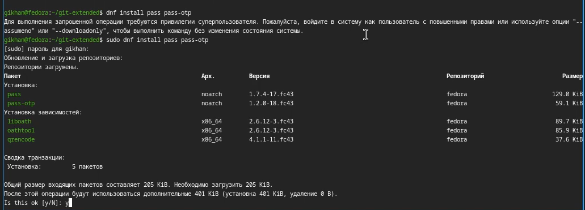
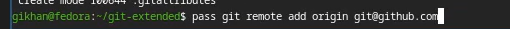

# Информация

## Докладчик

:::::::::::::: {.columns align=center}
::: {.column width="70%"}

  * Хан Георгий Игоревич
  * Студент НКАбд-06-25
  * я гоша
  * Российский университет дружбы народов
  * [1032253504@rudn.ru](mailto:1032253504@rudn.ru)


# Цель работы

## Цель

Получение практических навыков работы с менеджером паролей pass, а также освоение инструмента управления конфигурационными файлами chezmoi.

# Задание

## Задание

- Установить и настроить менеджер паролей pass
- Настроить синхронизацию хранилища паролей с git
- Установить и настроить chezmoi
- Создать репозиторий dotfiles и подключить его к системе

# Теоретическое введение

## Менеджер паролей pass

- pass — стандартный менеджер паролей для Unix
- Данные хранятся в файловой системе в виде каталогов и файлов
- Файлы шифруются с помощью GPG-ключа
- Поддерживает синхронизацию через git

## chezmoi

- Инструмент для управления конфигурационными файлами домашнего каталога
- Состояние файлов сохраняется в каталоге ~/.local/share/chezmoi
- Поддерживает шаблоны и работу на нескольких машинах

# Выполнение лабораторной работы

## Установка pass

Устанавливаем менеджер паролей pass и pass-otp с помощью пакетного менеджера dnf.

{width=70%}

## Настройка синхронизации с git

Инициализируем git-репозиторий для хранилища паролей и добавляем удалённый репозиторий.

{width=70%}

## Подключение репозитория

Указываем адрес удалённого репозитория на GitHub для синхронизации хранилища паролей.

{width=70%}

## Установка дополнительного программного обеспечения

Устанавливаем дополнительные утилиты и шрифты, необходимые для настройки рабочей среды:

```bash
sudo dnf -y install dunst fontawesome-fonts powerline-fonts \
    light fuzzel swaylock kitty waybar swaybg \
    wl-clipboard mpv grim slurp
sudo dnf copr enable peterwu/iosevka
sudo dnf install iosevka-fonts iosevka-term-fonts
```

## Установка chezmoi

Устанавливаем chezmoi с помощью скрипта — утилита автоматически определяет архитектуру системы и скачивает нужную версию.

{width=70%}

## Создание репозитория dotfiles и инициализация chezmoi

Создаём репозиторий dotfiles на основе шаблона и инициализируем chezmoi, подключив его к репозиторию.

{width=70%}

# Домашнее задание

Домашнее задание выполнено в рамках лабораторной работы.

# Выводы

В результате выполнения лабораторной работы были получены практические навыки работы с менеджером паролей pass и инструментом управления конфигурационными файлами chezmoi. Настроена синхронизация хранилища паролей с git, создан репозиторий dotfiles и подключён к системе.
