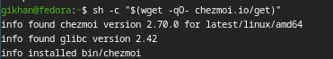
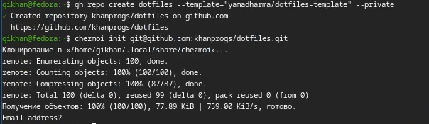

# Цель работы

Получение практических навыков работы с менеджером паролей pass, а также освоение инструмента управления конфигурационными файлами chezmoi.

# Задание

- Установить и настроить менеджер паролей pass
- Настроить синхронизацию хранилища паролей с git
- Установить дополнительное программное обеспечение и шрифты
- Установить и настроить chezmoi
- Создать репозиторий dotfiles и подключить его к системе

# Теоретическое введение

Менеджер паролей pass — программа, сделанная в рамках идеологии Unix. Данные хранятся в файловой системе в виде каталогов и файлов, которые шифруются с помощью GPG-ключа. Поддерживается синхронизация хранилища паролей через git.

chezmoi — инструмент для управления конфигурационными файлами домашнего каталога пользователя. Состояние файлов конфигурации сохраняется в каталоге ~/.local/share/chezmoi, который является клоном репозитория dotfiles. Поддерживает шаблоны и работу на нескольких машинах одновременно.

# Выполнение лабораторной работы

Устанавливаем менеджер паролей pass и pass-otp с помощью пакетного менеджера dnf. (рис. [-@fig:001])

{#fig:001 width=70%}

Инициализируем git-репозиторий для хранилища паролей и добавляем удалённый репозиторий. (рис. [-@fig:002])

{#fig:002 width=70%}

Указываем адрес удалённого репозитория на GitHub для синхронизации хранилища паролей. (рис. [-@fig:003])

{#fig:003 width=70%}

Устанавливаем дополнительное программное обеспечение, необходимое для настройки рабочей среды, а также шрифты iosevka. 

Устанавливаем chezmoi (рис. [-@fig:004])

{#fig:004 width=70%}

Создаём репозиторий dotfiles на основе шаблона и инициализируем chezmoi, подключив его к репозиторию на GitHub. (рис. [-@fig:005])

{#fig:005 width=70%}

# Выводы

В результате выполнения лабораторной работы были получены практические навыки работы с менеджером паролей pass и инструментом управления конфигурационными файлами chezmoi. Настроена синхронизация хранилища паролей с git, установлено дополнительное программное обеспечение и шрифты, создан репозиторий dotfiles и подключён к системе.

# Список литературы{.unnumbered}

::: {#refs}
:::
